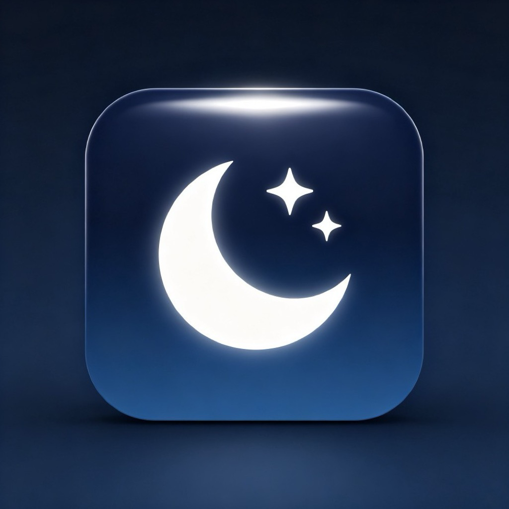

# NoSleep

<p align="center">
  
  <br>
  <strong>A minimalist macOS menu bar app that prevents your Mac from sleeping, screen locking, and display turning off.</strong>
</p>

<p align="center">
  
  
  
  
</p>

---

## Features

- **Prevent System Sleep** -- Stops macOS from entering sleep mode via IOKit power assertions
- **Prevent Screen Lock** -- Keeps the display on and prevents the lock screen
- **One-Toggle Design** -- A single switch controls both behaviors simultaneously
- **Lightweight** -- Runs as a menu bar app (no Dock icon), minimal resource usage
- **10 Languages** -- Supports Chinese, English, Japanese, Korean, French, German, Spanish, Portuguese, Russian, and Arabic
- **Language Auto-Detection** -- Automatically detects your system language on first launch
- **RTL Support** -- Full right-to-left layout support for Arabic
- **Zero Dependencies** -- Pure Swift + IOKit, no third-party packages required
- **One-Click Build** -- Double-click `build.command` to compile, sign, and package as DMG

## Screenshots

### Chinese
The app lives in the menu bar. Click the moon icon to open the popover panel where you can toggle sleep prevention on/off, switch languages, or quit the app.

### How It Works
1. Launch NoSleep -- it appears in your menu bar as a moon icon
2. Click the icon to open the control panel
3. Toggle the switch ON -- your Mac will stay awake and the screen will remain on
4. Toggle OFF -- your Mac returns to normal sleep behavior
5. Right-click the menu bar icon for quick access to About and Quit

## Supported Languages

| Language | Code |
|----------|------|
| 简体中文 | `zh-Hans` |
| English | `en` |
| 日本語 | `ja` |
| 한국어 | `ko` |
| Français | `fr` |
| Deutsch | `de` |
| Español | `es` |
| Português (Brasil) | `pt-BR` |
| Русский | `ru` |
| العربية | `ar` |

## Requirements

- **macOS 12.0+** (Monterey or later)
- **Xcode Command Line Tools** -- install via `xcode-select --install`
- **Swift 5.7+**

## Installation

### Option 1: Build from Source

```bash
# Clone the repository
git clone https://github.com/XYRZX/NoSleep.git
cd NoSleep

# One-click build (compile, sign, package DMG)
./build.command
```

The script will:
1. Generate the app icon from `icon_1024.png`
2. Compile all Swift sources
3. Generate `Info.plist`
4. Code-sign the app (auto-detects your signing certificate, falls back to ad-hoc)
5. Package as a DMG installer on your Desktop

### Option 2: Manual Build

```bash
swiftc -o NoSleep \
    -framework Cocoa \
    -framework SwiftUI \
    -framework IOKit \
    -framework Combine \
    Sources/NoSleep/*.swift
```

### Option 3: Download DMG

Download the latest release from the [Releases](https://github.com/XYRZX/NoSleep/releases) page.

## Project Structure

```
NoSleep/
├── Sources/
│   └── NoSleep/
│       ├── main.swift            # App entry point
│       ├── AppDelegate.swift     # Menu bar setup, popover management
│       ├── ContentView.swift    # SwiftUI UI (toggle, language selector, quit)
│       ├── SleepPreventer.swift  # IOKit power assertion logic
│       └── L10n.swift            # Localization (10 languages, inline dictionary)
├── icon_1024.png                 # App icon source (1024x1024)
├── icon_1024.jpg                 # App icon JPEG copy
├── Package.swift                 # Swift Package Manager manifest
├── build.command                  # One-click build script
└── README.md                      # This file
```

## Technical Details

### How Sleep Prevention Works

NoSleep uses macOS IOKit Power Management assertions (`IOPMAssertionCreateWithName`):

- **`kIOPMAssertionTypePreventUserIdleSystemSleep`** -- Prevents the system from entering idle sleep
- **`kIOPMAssertionTypePreventUserIdleDisplaySleep`** -- Prevents the display from turning off

These assertions are automatically released when:
- The user toggles the switch OFF
- The app quits (handled in `applicationWillTerminate`)

### Localization Architecture

Instead of traditional `.lproj` bundles (which require Xcode build settings), NoSleep uses an inline dictionary approach in `L10n.swift`:

- All translations are embedded as Swift dictionaries at compile time
- No additional resource files or build steps needed
- Language preference is persisted in `UserDefaults`
- Auto-detects system language on first launch
- Falls back to English for any missing translations

### Why No Xcode Project?

This project is intentionally built with a single `swiftc` command and a shell script:

- **Transparency** -- anyone can understand the full build process by reading `build.command`
- **Simplicity** -- no `.xcodeproj`/`.xcworkspace` files that change with Xcode versions
- **CI-Friendly** -- the build script works identically on local machines and CI servers
- **No Lock-In** -- doesn't require Xcode (Command Line Tools are sufficient)

## Contributing

Contributions are welcome! Here's how you can help:

### Add a New Language

1. Open `Sources/NoSleep/L10n.swift`
2. Add a new entry to the `supportedLanguages` array
3. Add a new dictionary with all keys in `strings` closure
4. Add a mapping in `systemLocale` if needed

### Reporting Issues

If you find a bug or have a feature request, please [open an issue](https://github.com/XYRZX/NoSleep/issues).

### Pull Requests

1. Fork the repository
2. Create a feature branch (`git checkout -b feature/my-feature`)
3. Commit your changes
4. Push to the branch (`git push origin feature/my-feature`)
5. Open a Pull Request

## License

This project is licensed under the MIT License. See the [LICENSE](LICENSE) file for details.

## Acknowledgments

- Built with [Swift](https://swift.org) and [SwiftUI](https://developer.apple.com/xcode/swiftui/)
- Uses [IOKit Power Management](https://developer.apple.com/documentation/iokit) for sleep prevention
- App icon designed with a clean, macOS-native aesthetic
